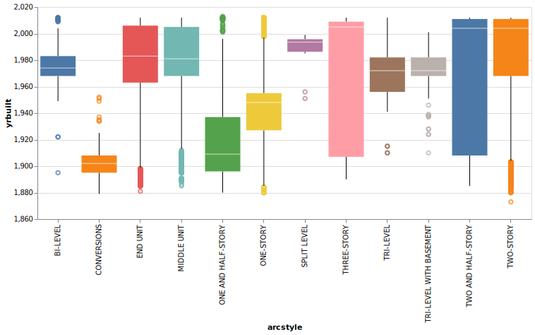
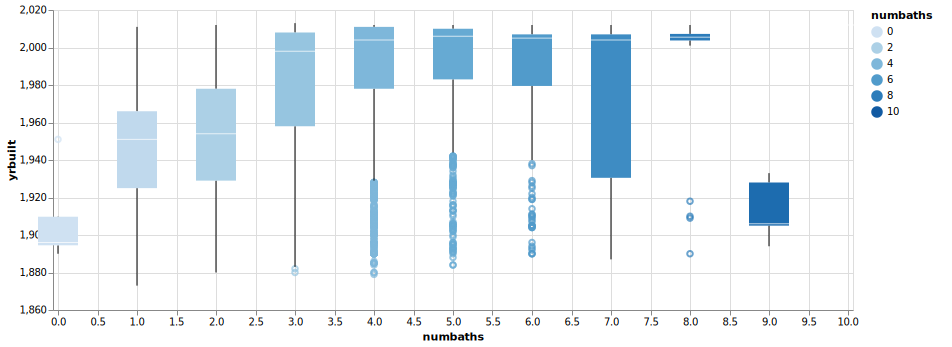
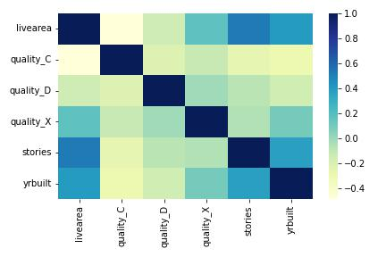
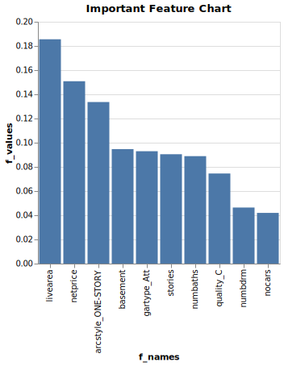

# Was This Home Built Before 1980?

__Lisa Child__


## Project Summary

_This project uses data from the city of Denver from home sales data to try to create a model through machine learning that will help identify homes in a different database for the state of Colorado whether they are built before 1980 or after that year. The project attempts to gather information on the data through graphs helping to decide on key features that are needed for an effective machine learning model. Through a process a design will be decided on and then tested for accuracy._

## Technical Details

_The following three charts are to gather information on possible home "features" that help in creating a model to divide houses that were built before 1980 from those built after 1980._

- _Chart 1 shows a spread of the "arcstyle" or types of homes._

- _Chart 2 shows a spread of the quantity of bathrooms in each home._

- _Chart 3 is a correlation heathmap reflecting the relationships of the different features of each home._

<br> <br/>
<br> <br/>
<br> <br/>
<br> <br/>
<br> <br/>
<br> <br/>


#### Evaluating Relationships to Develop an Algorithm for the Prediction Model

######_Chart 1_



_The boxplot graph shows, on their own without including relationships with other house features, there are "types" or "arcstyles" of homes that are specific to the time period before 1980. The "Conversions" and "One and half-story" are build out types before 1980. "End unit", "middle unit" and "two story" type homes show a trend of build outs after 1980. Some of the other types also show medians clearly after 1980 or before, making this feature appear to be helpful in building a model for training and testing the data._

<br> <br/>
<br> <br/>
<br> <br/>


######_Chart 2_


_The above chart shows that the number of bathrooms is an important feature to distinguish a home built before 1980 and after. There is a trend as the number of bathrooms increases the hones tend to be built after 1980. There is some potential confusing data of homes with 9 and 10 bathrooms reflecting being built before 1980. That may change the model slightly. There are some tails on the boxes with 4, 5, and 6 bathrooms that may also affect the model. Later we will see in a chart that shows the importance of features for the model, that bathrooms is an important feature._

######_Chart 3_


_The above heatmap is a correlation feature map reflecting that certain features in conjuction with other features have a relationship correlating to the year the homes were built. The darker the color the stronger the correlation to the year the house was built. For instance the features of "livearea" and "stories" have a stronger relationship than "quality_C". In my model for testing the data I used those features. However, I used "quality_C" in the model and it added to the prediction viability score.(Not sure the reason on that.)_

#### Building Out the Classification Prediction Model 

_The following code shows the features used to find a good split for testing and training the data on and the model chosen to reach a 90% prediction accuracy._
```python
x_pred = dwellings_ml.filter(['arcstyle_ONE-STORY','gartype_Att','quality_C', 'livearea', 'basement', 'stories', 'tesp', 'netprice', 'numbdrm', 'finbsmt', 'numbaths', 'nocars', 'arcstyle_SPLIT LEVEL'])
y_pred =  dwellings_ml['before1980']       

X_train, X_test, y_train, y_test = train_test_split(
    x_pred, 
    y_pred, 
    test_size = .34, 
    random_state = 76)
```
```python
from sklearn.ensemble import RandomForestClassifier
# %%
clf = RandomForestClassifier()
clf = clf.fit(X_train, y_train)
y_pred = clf.predict(X_test)
y_probs = clf.predict_proba(X_test)
metrics.accuracy_score(y_test,y_pred)
```

_Accuracy level from the test:_
######0.9220895905532024

_Guessing by logic of what features may be of  importance to distinguish what year homes were built resulted in an accuracy level in the 80th percentile. Several approaches were tested before finally reaching a the goal of at least 90 percent. The first approach involved using the features from the three graphs above, then adding more features, using different models such as the Decision Tree Classifier, the Gradient Boosting Classifier, the Kneighbors Classifier, and the Gaussian Classifier; all of which were not successful. At times there was improvement and then there was regression. Loading all the features was not the answer either. Using the features from the chart below was also not succesful. Finally I added what seemed to make the most sense and added others finally making the right combinations of features for the decision tree. The selling "sprice" feature was included but mispelled and so it wasn't used and when corrected it lowered the accuracy and that feature was then removed. It was a process, not necessarily something I could reason out what worked and what didn't. Ultimately, the Random Forest Classifier did the job with the features shown in the above code._ 


#### Justifying the Model



- _The important feature chart shows by values what features are most helpful in distinguishing what homes were built before 1980 and after. It represents the features that were above .02. The number is based on a mean decrease in impurity. (Complicated math.)_  


- _All these features were included in the model for the split test. The features for "finished basement" and "split_level" were also added to the model on some personal logical thinking._
<br> <br/>
<br> <br/>
<br> <br/>
<br> <br/>
<br> <br/>
<br> <br/>


#### Evaluating the Model

_Evaluating the model we are going to look at accuracy, precision, recall,  and the ROC curve. Through reasoning we will figure out which measurement is best to measure the quality of the model, and ultimately state how well this model will work with this type of data._

|           |           0 |           1 |   accuracy |   macro avg |   weighted avg |
|:----------|------------:|------------:|-----------:|------------:|---------------:|
| precision |    0.883721 |    0.945688 |    0.92209 |    0.914705 |        0.92275 |
| recall    |    0.909154 |    0.929692 |    0.92209 |    0.919423 |        0.92209 |
| f1-score  |    0.896257 |    0.937622 |    0.92209 |    0.91694  |        0.92231 |
| support   | 2884        | 4907        |    0.92209 | 7791        |     7791       |

- _The accuracy of the model is at .92. Accuracy measure the total number of homes that were predicted correctly as being before 1980 and after 1980. In a 100 homes 92 would be predicted correctly and 8 would be missed labeled._


- _The recall of the model is at .93. Recall measures the homes that were labeled before 1980 correctly / the number of homes labeled before 1980 correctly plus the homes that were labeled after 1980 but were actually before 1980._

- _The precision of the model is at .95. Precision measures the homes that were labeled before 1980 correctly /  the number of homes that were labeled before 1980 correctly plus the number of homes labeled before 1980 but actually after 1980._

_Accuracy is not a good measurement in this case because the number of homes that were actually before 1980 are not proportional to the number of homes that were after 1980._

_Using recall and precision together is a better measurement to evaluate this model. The precision value is a higher percentage than recall. In this case since we are trying to label homes with asbestos accurately for the risk of asbestos the recall score needs to improve which means the precision score will decrease. It would be better to increase the false positives, ie labeling homes that are before 1980 but predicted as after. The number of homes that were labeled for simple terms as  not having asbestos when they actually do would decrease. We can adjust the model to reflect a higher recal by decreasing the classification threshold. The f1 score in favor of labling correctly the houses that are before 1980 would increase and the number of houses that after 1980 but labeled as before would also increase. It all depends on the why of Colorado needing the knowledge of the build out of houses before or after 1980 and the risk involved. The model can be adjusted to compensate for whichever classification is more important in the model, labeling more homes before 1980 and mislabling some or labeling fewer homes before 1980 and missing some that actually are before built before 1980. The purpose is not clearly stated so this model works with appropriate accuracy for both._
```
# code to check accuracy of the model.
print(metrics.confusion_matrix(y_test, y_pred))
metrics.plot_confusion_matrix(clf, X_test, y_test)
# %%
# accuracy of the model
Accuracy = (4562 + 2622)/(262 + 345 + 4562+ 2622)

Accuracy
# %%
# precision-recall
precision = 4562/ (4562 + 345)
precision
# %%
recall = 4562/(4562 + 262)
recall
````


## Appendix A


```python
# %%
import pandas as pd 
import numpy as np
import seaborn as sns
import altair as alt
import matplotlib.pyplot as plt
from vega_datasets import data
# %%
from sklearn.model_selection import train_test_split
from sklearn import tree

from sklearn.ensemble import GradientBoostingClassifier
from sklearn import metrics
from sklearn.tree import DecisionTreeClassifier
# %%
dwellings_denver = pd.read_csv("https://github.com/byuidatascience/data4dwellings/raw/master/data-raw/dwellings_denver/dwellings_denver.csv")
dwellings_ml = pd.read_csv("https://github.com/byuidatascience/data4dwellings/raw/master/data-raw/dwellings_ml/dwellings_ml.csv")
dwellings_neighborhoods_ml = pd.read_csv("https://github.com/byuidatascience/data4dwellings/raw/master/data-raw/dwellings_neighborhoods_ml/dwellings_neighborhoods_ml.csv")   

alt.data_transformers.enable('json')
# %%
# preliminary investigating the data
dwellings_denver.head()
# %%
dwellings_neighborhoods_ml.head()
# %% 
dwellings_ml.head()
# %%
dwellings_ml.syear.describe()
# shows house sold multiple times
# %%
dwellings_ml.parcel.value_counts()
# data represents sale. Need to filter so it represents house not house/sale
# %%
dwellings_ml.columns

# %%
# code from Hathaway class
h_subset = dwellings_ml.filter(['livearea', 'finbsmnt', 
    'basement', 'yearbuilt', 'nocars', 'numbdrm', 'numbaths', 
    'stories', 'yrbuilt', 'before1980']).sample(500)


sns.pairplot(h_subset, hue = 'before1980')

corr = h_subset.drop(columns = 'before1980').corr()
# %%
sns.heatmap(corr)
# %%
# Grand Question 1
alt.data_transformers.enable('data_server')
# %%
dwellings_denver.arcstyle.unique()
# %%
# Grand 1 Chart 1
arc_chart = (alt.Chart(dwellings_denver)
.mark_boxplot(
size = 50
)
.encode(
x = 'arcstyle',
y = alt.Y('yrbuilt', scale=alt.Scale(zero=False)),
color=alt.Color('arcstyle', legend=None))
.properties(
    width = 900
    )
)
arc_chart
# %%
arc_chart.save("arc_chart.svg")
# %%
# info for Grand 1 Chart 2
dwellings_ml.numbaths.value_counts()
# %%
# Grand 1 Chart 2
bath_df = dwellings_ml.filter(['numbaths', 'yrbuilt'])
# %%
bath_chart = (alt.Chart(bath_df)
.mark_boxplot(
    size = 40
)
    .encode(
    x = alt.X('numbaths:O'),
    y = alt.Y('yrbuilt', scale = alt.Scale(zero=False)),
    color=alt.Color('numbaths'))
    .properties(
    width = 800
    )    
)
bath_chart
# %%
bath_chart.save("bath_chart.svg")

# %%
# Grand 1 Chart 3
dwellings_ml.livearea.value_counts()
# %%
# didn't end up using this
livearea_df = dwellings_ml.filter(['livearea', 'before1980'])
# %%
h_subset = dwellings_ml.filter(['livearea', 'quality_C', 'quality_D', 'quality_X', 'stories', 'yrbuilt',]).sample(500)

corr = h_subset.corr()

# %%
dwelling_heatmap = sns.heatmap(data = corr, cmap = "YlGnBu")

plt.tight_layout()

dwelling_heatmap1 = dwelling_heatmap.get_figure()

dwelling_heatmap1.savefig("dwelling_heatmap.jpg")


# %%
# Grand Question 2
# RAN CODE WITH EVERYTHING TO FIGURE OUT WHICH FEATURES ARE OF IMPORTANCE GREATER THAN .20
# 

x_pred = dwellings_ml.filter(['arcstyle_ONE-STORY','gartype_Att','quality_C', 'livearea', 'basement', 'stories', 'netprice', 'numbdrm', 'finbsmt', 'numbaths', 'nocars', 'arcstyle_SPLIT LEVEL'])
y_pred =  dwellings_ml['before1980']       

X_train, X_test, y_train, y_test = train_test_split(
    x_pred, 
    y_pred, 
    test_size = .34, 
    random_state = 76)

# %%
# create the model
clf = GradientBoostingClassifier()

# train the model, give feature and target
clf = clf.fit(X_train, y_train)

# make predictions
y_predictions = clf.predict(X_test)

# test how accurate predictions are
metrics.accuracy_score(y_test, y_predictions)

# %%
# tried this it was not a good fit model
from sklearn.neighbors import KNeighborsClassifier

# finally worked
from sklearn.ensemble import RandomForestClassifier
# %%
clf = RandomForestClassifier(random_state = 10)
clf = clf.fit(X_train, y_train)
y_pred = clf.predict(X_test)
y_probs = clf.predict_proba(X_test)
metrics.accuracy_score(y_test,y_pred)

# %%
# This code helps figure out the feature importance 
df_features = pd.DataFrame(
    {'f_names': X_train.columns, 
    'f_values': clf.feature_importances_}).sort_values('f_values', ascending = False)

df_features    

# %%
G3_chart = alt.Chart(df_features.query("f_values > .02"), width = 300, title = "Important Feature Chart").encode(alt.X('f_names', sort = "-y"), alt.Y('f_values')).mark_bar()
G3_chart
# %%
G3_chart.save("G3_chart.svg")
# %%
G3_Feature_chart = df_features.query("f_values > .02").plot.bar(x = 'f_names', y = 'f_values', title = "Important Feature Chart")

G3_Feature_chart
# %%
# couldn't get sizing right for labels
plt.figure(figsize=(12,18))
plt.tight_layout()
G3_Feature_chart = G3_Feature_chart.get_figure()
G3_Feature_chart.savefig("G3_Feature_chart.jpg")

# %%
# Grand Question 4
print(metrics.confusion_matrix(y_test, y_pred))
metrics.plot_confusion_matrix(clf, X_test, y_test)
# %%
# accuracy of the model
Accuracy = (4562 + 2622)/(262 + 345 + 4562+ 2622)

Accuracy
# %%
# precision-recall
precision = 4562/ (4562 + 345)
precision
# %%
recall = 4562/(4562 + 262)
recall

# %%
metric_table = print(metrics.classification_report(y_test, y_pred))
#table = metric_table.to_markdown()
# %%
metrics.plot_roc_curve(clf, X_test, y_test)
# %%
table = pd.DataFrame(metrics.classification_report(y_test, y_predictions, output_dict=True)).T
df = pd.DataFrame(table).transpose()
print(df.to_markdown())

```